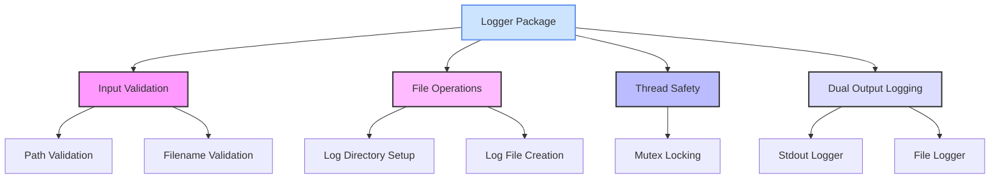

# Logger

## Project Summary

Logger is a thread-safe, configurable logging utility for Go applications.

## Detailed Description

This package provides a leveled logging system that writes to both standard output and a log file. It is designed with a focus on explicit behavior, robust error handling, and maintainable code, adhering to Go's design principles.

Key features include:

-   **Thread-Safe Logging**: Safely log from multiple goroutines.
-   **Leveled Logging**: Supports `INFO`, `WARN`, `ERROR`, `SUCCESS`, `FATAL`, `PANIC`, and `SYSTEM` levels.
-   **Dual Output**: Logs to both `stdout` and a specified file.
-   **Path Validation**: Includes security measures to prevent directory traversal attacks.
-   **High Performance**: Uses optimized string formatting for efficient logging.

## Technology Stack

-   **Programming Language:** Go 1.25

## Getting Started

### Prerequisites

-   Go 1.25 or later.

### Installation

To use this library in your project, you can use `go get`:

```bash
go get github.com/book-expert/logger
```

## Usage

To use the logger, create a new instance with a specified log directory and filename.

```go
package main

import (
    "github.com/book-expert/logger"
)

func main() {
    log, err := logger.New("/tmp/logs", "app.log")
    if err != nil {
        panic(err)
    }
    defer log.Close()

    log.Info("This is an informational message.")
    log.Warn("This is a warning message.")
    log.Error("This is an error message.")
}
```

## API Reference

### `New(logDir, filename string) (*Logger, error)`

Creates a new `Logger` instance. `logDir` is the directory where the log file will be created, and `filename` is the name of the log file.

### `Close() error`

Closes the log file and releases resources.

### Logging Methods

The logger provides the following methods for leveled logging:

-   `Info(format string, args ...any)`
-   `Warn(format string, args ...any)`
-   `Error(format string, args ...any)`
-   `Success(format string, args ...any)`
-   `Fatal(format string, args ...any)`
-   `Panic(format string, args ...any)`
-   `System(format string, args ...any)`

## Testing

To run the tests for this library, you can use the `make test` command:

```bash
make test
```

This will run the tests and display the coverage.

### Architecture Diagram



## License

Distributed under the MIT License. See the `LICENSE` file for more information.